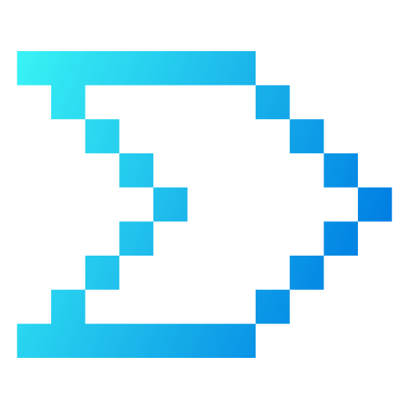
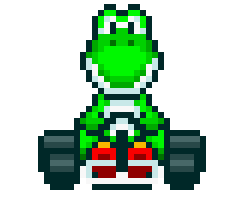

# Mario Kart.JS
### About
Project based on the activity done in the Node.js Fundamentals course, at DIO. Base project link: https://github.com/digitalinnovationone/formacao-nodejs/tree/main/03-projeto-mario-kart

## Players

### Mario

| Attribute | Value |
| --------- | ----- |
|  Speed | 4 |
|  Handling | 3 |
|  Power | 3 |

### Peach

| Attribute | Value |
| --------- | ----- |
|  Speed | 3 |
|  Handling | 4 |
|  Power | 2 |

### Yoshi

| Attribute | Value |
| --------- | ----- |
|  Speed | 2 |
|  Handling | 4 |
|  Power | 3 |

### Bowser

| Attribute | Value |
| --------- | ----- |
|  Speed | 5 |
|  Handling | 2 |
|  Power | 5 |

### Luigi

| Attribute | Value |
| --------- | ----- |
|  Speed | 3 |
|  Handling | 4 |
|  Power | 4 |

### Donkey Kong

| Attribute | Value |
| --------- | ----- |
|  Speed | 2 |
|  Handling | 2 |
|  Power | 5 |
